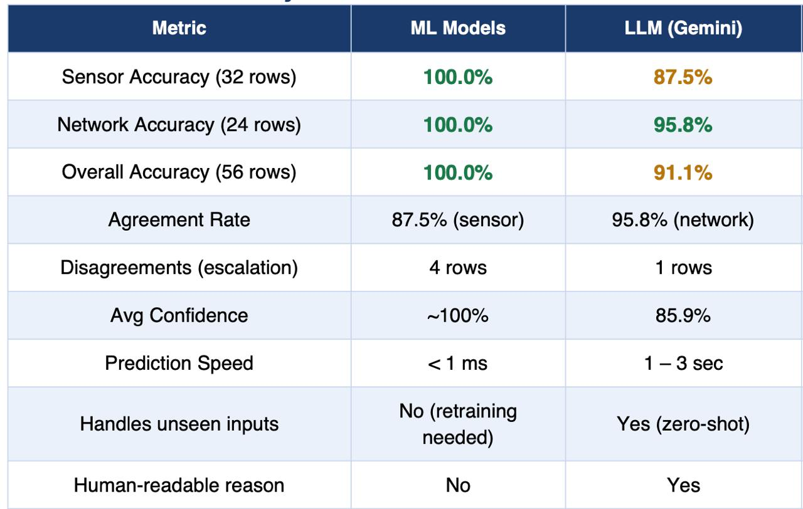

# 🧠 Multimodal Classification Agent

## What is this project?

This project builds an AI agent that can classify four different types of industrial and business data — documents, sensor readings, network traffic, and tool images — and returns a predicted class, a confidence score, and a human-readable explanation for every input.

The unique aspect of this project is the **dual-method design**: the same input is classified by two completely independent methods, and their results are compared. This gives a built-in cross-check — when both methods agree, we act confidently; when they disagree, we escalate to a human.

---

## Two Classification Methods

### Method 1 — MCP Server (Google Gemini AI)
Uses **Google Gemini** (a Large Language Model) called through **Model Context Protocol (MCP)** tool servers. Each input type has its own dedicated MCP tool that sends the data to Gemini with a structured prompt and receives a schema-validated JSON response.

**Strengths:** Understands natural language, handles unseen inputs, explains its reasoning, works on new data types without retraining.  
**Limitation:** Requires an API key, takes 1–3 seconds per classification.

### Method 2 — ML Models (Traditional Machine Learning)
Uses trained **GMM + KMeans** (sensor) and **Random Forest** (network) models that were trained on 10,000 rows of labeled synthetic data. Predictions are made locally in under 1 millisecond with no API call.

**Strengths:** Instant predictions, calibrated confidence scores, works offline, no API cost.  
**Limitation:** Only covers sensor and network data; cannot handle document or image types without retraining.

---

## Method Comparison Results

The two methods were tested on **56 labeled rows** (32 sensor + 24 network) to measure accuracy, speed, and agreement:



### Key Findings

**Sensor data — ML model wins clearly (100% vs 87.5%)**  
The GMM was trained on the exact value distributions our system uses (Temperature ~25°C, Humidity ~65%, Moisture ~450 ADC, Vibration ~850 ADC). It leverages learned Gaussian posteriors to classify with near-certainty. The LLM must infer the same ranges from a text description, which introduces uncertainty especially on raw ADC values (Moisture and Vibration).

**Network data — near tie (100% vs 95.8%)**  
The Random Forest learned exact threshold rules from labeled data (e.g. `syn_ratio > 0.5 + unique_ports > 20 = Suspicious`). Gemini understands qualitative network security patterns and almost matches accuracy, while also providing human-readable explanations that the RF cannot produce.

**The 5 disagreement rows are the most valuable output.**  
These are the inputs where the two methods diverge — exactly the cases that should trigger human review in a real deployment. The disagreement itself is a confidence signal.

**Recommendation:** Use both. ML model for fast primary classification (< 1ms). When confidence is low or methods disagree, escalate to Gemini for a second opinion and a human-readable explanation.

---

## Application Modes

The app has three modes selectable from the sidebar:

### 🔮 MCP Server (Gemini AI)
Classifies using Google Gemini through MCP tool servers. Supports:

| Input Type | What you provide | Classes returned |
|---|---|---|
| 📄 Document | Paste text (invoice, report, contract, manual) | Invoice / Report / Contract / Manual |
| 📡 Sensor Data | Sensor readings — labeled or plain numbers | Sensor type + Normal / Fault |
| 🌐 Network Packet | Traffic or log description | Normal / Suspicious / Priority |
| 🔧 Image (Tools) | Photo from camera or file upload | Tool name + Category + Condition |
| 📹 Real-time Scanner | Live webcam | Auto-detects tools every 10 seconds |

Each text modality has two tabs:
- **✏️ Manual Input** — type/paste and classify
- **📁 Batch File Upload** — upload a CSV, classify all rows, get a results table

### ⚙️ ML Model
Classifies using locally trained models. No API key required.

| Model | Algorithm | Input | Classes |
|---|---|---|---|
| 📡 Sensor Classifier | GMM + KMeans (unsupervised) | Single raw numeric value | Temperature / Humidity / Moisture / Vibration |
| 🌐 Network Classifier | Random Forest (supervised) | 6 flow feature values | Normal / Suspicious / Priority |

Each model has three tabs:
- **ℹ️ About** — algorithm, training data, accuracy
- **🔢 Single Prediction** — input fields + instant prediction
- **📁 Batch Upload** — CSV upload + results table + download

### ⚖️ Compare Both
Upload a labeled CSV — both methods classify every row. Shows accuracy per method, agreement rate, and disagreement rows highlighted as escalation candidates.

---

## Project Structure

```
.
├── streamlit_app.py                  # Main app — all three modes
├── classification_mcp_server.py      # MCP server — 4 Gemini-backed tools
├── classification_agent.py           # CLI alternative (optional)
│
├── ml_models/
│   ├── sensor_model.py               # GMM + KMeans sensor classifier
│   ├── network_model.py              # Random Forest network classifier
│   └── train_all.py                  # Trains models + exports training CSVs
│
├── training_data/                    # Generated by train_all.py
│   ├── sensor_training_data.csv      # 10,000 rows used to train sensor model
│   └── network_training_data.csv     # 10,002 rows used to train network model
│
├── sample_data/                      # Ready-to-upload test files
│   ├── sensor_data.csv               # 20 sensor readings (ML + MCP Sensor)
│   ├── network_data.csv              # 15 network flows (ML + MCP Network)
│   ├── document_data.csv             # 5 documents (MCP Document)
│   ├── mcp_sensor_data.csv           # 5 text sensor descriptions (MCP Sensor)
│   └── mcp_network_data.csv          # 5 text network events (MCP Network)
│
├── test_data/                        # Labeled data for accuracy testing
│   ├── sensor_test.csv               # 32 labeled rows (ground truth included)
│   └── network_test.csv              # 24 labeled rows (ground truth included)
│
├── assets/
│   ├── tech_mahindra_logo.png        # Logo shown in navbar
│   └── comparison_table.png          # ML vs LLM accuracy comparison table
│
├── .streamlit/
│   └── config.toml                   # Streamlit theme (blue-gray background)
│
├── requirements.txt
├── .env.example
└── .gitignore
```

---

## Training Data

Both models are trained on **10,000 rows of synthetic data** generated inside the model Python files when you run `train_all.py`. No pre-existing CSV files are needed for training — the data is created mathematically at runtime using NumPy's random distributions, then the trained model is saved as a `.joblib` file.

After running `train_all.py`, the full training data is also exported to CSV so you can inspect it:

| File | Rows | Description |
|---|---|---|
| `training_data/sensor_training_data.csv` | 10,000 | 2,500 rows per sensor type (Temperature, Humidity, Moisture, Vibration) |
| `training_data/network_training_data.csv` | 10,002 | 3,334 rows per traffic class (Normal, Suspicious, Priority) |

**Sensor value ranges (training distribution):**

| Sensor | Mean | Std | Range |
|---|---|---|---|
| Temperature | 25.0 °C | ±3.0 | 10–40 |
| Humidity | 65.0 % | ±5.0 | 50–85 |
| Moisture (ADC) | 450 raw | ±20 | 400–500 |
| Vibration (ADC) | 850 raw | ±25 | 800–900 |

---

## Setup

### 1. Get a Gemini API key *(for MCP Server mode)*
Go to [aistudio.google.com/apikey](https://aistudio.google.com/apikey) → Create API key.  
Must start with `AIzaSy...`. ML Model mode works without a key.

### 2. Virtual environment + dependencies

```bash
python3 -m venv venv
source venv/bin/activate        # macOS/Linux
venv\Scripts\activate           # Windows

pip install -r requirements.txt
```

### 3. Add your API key

```bash
cp .env.example .env
```

Edit `.env`:
```
GEMINI_API_KEY=AIzaSy...your-real-key...
```

### 4. Train the ML models *(one time only)*

```bash
python ml_models/train_all.py
```

This trains both models, saves them as `.joblib` files, exports the 10,000-row training CSVs, and generates the labeled test CSVs.

Expected output:
```
Training Sensor Model (GMM + KMeans)
  GMM    train accuracy : 100.0%
  KMeans train accuracy : 100.0%
  Training data → training_data/sensor_training_data.csv  (10,000 rows)

Training Network Model (Random Forest)
  Train accuracy : 100.0%
  Training data → training_data/network_training_data.csv  (10,002 rows)
```

### 5. Run

```bash
streamlit run streamlit_app.py
```

Opens at `http://localhost:8501`.

> ⚠️ Always use `streamlit run`, never `python streamlit_app.py`.

---

## Example Inputs and Outputs

### MCP — Document Classification

**Input:**
```
INVOICE #4471. Bill to: Acme Corp.
Item: Cloud subscription (annual). Amount due: $1,200.
Payment due: 30 June 2026.
```

**Output:**
```json
{
  "category": "Invoice",
  "confidence_score": 0.97,
  "key_topics": ["billing", "amount due", "annual subscription"],
  "justification": "Contains invoice number, billing party, and total amount due."
}
```

---

### MCP — Sensor Data (labeled)

**Input:** `temperature=92C, vibration=8.4mm/s (baseline 1.2mm/s), pressure=stable`

**Output:**
```json
{
  "sensor_type": "Temperature/Vibration",
  "state": "Fault",
  "confidence_score": 0.91,
  "indicators": ["temperature 92°C above normal 20-35°C", "vibration 8.4mm/s vs 1.2 baseline"],
  "justification": "Both temperature and vibration exceed safe operating limits."
}
```

**Input (plain numbers, no labels):** `98.6`

**Output:**
```json
{
  "sensor_type": "Temperature",
  "state": "Fault",
  "confidence_score": 0.88,
  "indicators": ["98.6 falls in temperature range 10-40", "98.6°C exceeds normal maximum of 35°C"],
  "justification": "Value 98.6 is in the temperature range but far above the safe operating limit."
}
```

---

### MCP — Network Packet

**Input:** `TCP SYN flood from 14 source IPs targeting port 443, ~9000 pkt/sec, no completed handshakes`

**Output:**
```json
{
  "classification": "Suspicious",
  "confidence_score": 0.93,
  "signals": ["SYN flood pattern", "14 source IPs", "no completed handshakes"],
  "justification": "High-rate SYN packets from multiple IPs with no handshakes indicates a DDoS attempt."
}
```

---

### MCP — Image (Industrial Tools)

**Input:** Photo of tools on a workbench

**Output:**
```json
{
  "tools_detected": [
    {"tool_name": "Double Open-End Wrench", "category": "Hand Tool", "condition": "Good", "confidence_score": 0.97},
    {"tool_name": "Phillips Screwdriver",   "category": "Hand Tool", "condition": "Worn", "confidence_score": 0.88}
  ],
  "total_count": 2,
  "scene_description": "Two hand tools on a workbench.",
  "justification": "Both tools clearly visible. Screwdriver shows surface wear on tip."
}
```

---

### ML — Sensor Classifier (GMM + KMeans)

**Single input:** `value = 65.1`

**Output:**
```json
{
  "gmm_prediction": "Humidity",
  "kmeans_prediction": "Humidity",
  "confidence_score": 1.0
}
```

**CSV batch input format (`sample_data/sensor_data.csv`):**
```
value,ground_truth
25.3,Temperature
65.1,Humidity
446.25,Moisture
851.32,Vibration
```

---

### ML — Network Classifier (Random Forest)

**Single input (port scan):**
```
avg_packet_size = 60 bytes
byte_rate       = 500 B/s
duration        = 0.2 seconds
tcp_pct         = 0.5
unique_dst_ports= 80
syn_ratio       = 0.75
```

**Output:**
```json
{
  "classification": "Suspicious",
  "confidence_score": 1.0,
  "all_probabilities": {"Normal": 0.0, "Suspicious": 1.0, "Priority": 0.0}
}
```

**CSV batch input format (`sample_data/network_data.csv`):**
```
avg_packet_size,byte_rate,duration,tcp_pct,unique_dst_ports,syn_ratio,ground_truth
60,500,0.2,0.5,80,0.75,Suspicious
1200,200000,120,0.95,1,0.02,Priority
800,30000,3.0,0.8,3,0.07,Normal
```

---

## Common Errors

| Error | Cause | Fix |
|---|---|---|
| `Please pass a valid API key` | Key must start with `AIzaSy` | Get key from [aistudio.google.com/apikey](https://aistudio.google.com/apikey) |
| `missing ScriptRunContext` | Ran with `python` instead of `streamlit run` | Use `streamlit run streamlit_app.py` |
| `unhandled errors in a TaskGroup` | MCP server crashed on unexpected input | Fixed — each tool now has error handling |
| `429 Too Many Requests` | Gemini free-tier rate limit | Wait 60 seconds and retry |
| `Model not found` / joblib error | Models not trained yet | Run `python ml_models/train_all.py` |
| CSV column not found | Wrong column name | Check required column names in the upload hint |

---

## Tech Stack

| Layer | Technology |
|---|---|
| LLM | Google Gemini `gemini-2.5-flash` via OpenAI-compatible endpoint |
| Agent protocol | Model Context Protocol (MCP) — FastMCP |
| Sensor ML | Gaussian Mixture Model + KMeans — scikit-learn |
| Network ML | Random Forest (150 trees, balanced) — scikit-learn |
| UI | Streamlit — event-driven, multi-mode |
| Live camera | streamlit-webrtc + OpenCV |
| Auto-scan | streamlit-autorefresh |
| Image processing | Pillow |
| API client | `openai` Python SDK |
| Config | `python-dotenv` |